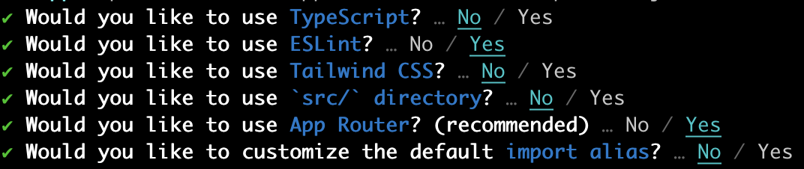

Next.js is a popular React.js framework and currently recommended by the React team for scaffolding new apps. It has a myriad of features, such as static site generation and server-side rendering, as well as built-in routing.

You don't have to understand these different patterns for rendering an app at this point but it helps to be familiar with them.

1. **Server-Side Rendering (SSR)**: With SSR, the server's responsibility is to render the web page on the server-side before sending it to the client's browser. This allows all the content to be visible to search engines, which can improve Search Engine Optimization (SEO). The downside is that it might lead to slower page load times because the client must wait for the server to render the page before it can be sent.

2. **Client-Side Rendering (CSR)**: With CSR, the server sends a minimal HTML file with JavaScript to the client. The JavaScript then takes over and renders the webpage on the client-side (in the user's browser). CSR can provide a smooth user experience after the initial load, as much of the content can change without requiring a full page reload. However, it might be less friendly for SEO, as search engine crawlers might have difficulty reading the dynamically loaded content.

3. **Static Site Generation (SSG)**: With SSG, all pages are pre-rendered at build time. This means that the server sends a static HTML file to the client, reducing the load on the server and potentially improving performance. SSG is particularly good for SEO and can provide very fast load times. However, it's less flexible for dynamic content changes than CSR or SSR, as changes generally require a new build of the site.

Next.js routing system operates based on the file structure. The essence of the routing process is basically mapping the URL to a `page.js` file nested within the `app` folder at your project's root. To use the routing system correctly, you'll need to understand how the way you name your files and folders informs the url structure.

## Part 1: Overview of Next.js Routing

In order to learn how to use routing and building a multi-page with Next.JS - we will be building an app that will display a sports team's roster and schedule.

To get started

```bash
npx create-next-app@latest <name_of_your_app>
```

Use these options to scaffold your project.



To create a route in Next.js, you'll create a new `page.js` file in the `app` folder. Next.js looks for `page.js` files within a folder to understand what view to show to a user at a certain route.

The `page.js` file at the root of your `app` folder is what a user will see when they visit the root of your site at `http://localhost:3000/`

Change it to this:

```jsx
// app/page.js

import styles from './page.module.css';

export default function Home() {
	return (
		<main className={styles.main}>
			<div className={styles.description}>
				<h1>Welcome to Our Team Page!</h1>
			</div>
		</main>
	);
}
```

Let's start by defining what our routes will be:

1. `/` — the homepage
2. `/roster` — the team’s roster
3. `/roster/:number` — a profile for a player, using the player’s number
4. `/schedule` — the team’s schedule of games

To create another route for our `roster` and `schedule` routes you would need to create an `roster` and `schedule` folder with a `page.js` file. The folder name determines the url path:

```jsx
// app/roster/page.js
export default function Roster() {
	return (
		<main>
			<div>
				<h1>Welcome to the Roster Page</h1>
			</div>
		</main>
	);
}
```

```jsx
// app/schedule/page.js
export default function Schedule() {
	return (
		<main>
			<div>
				<h1>Welcome to the Schedule Page</h1>
			</div>
		</main>
	);
}
```

To link pages add the following use the `Link` component from `next/link` and update your `layout.js` file:

```jsx
import Link from 'next/link';

export default function RootLayout({ children }) {
	return (
		<html lang='en'>
			<body>
				<nav>
					<ul>
						<li>
							<Link href='/'>Home</Link>
						</li>
						<li>
							<Link href='/about'>About</Link>
						</li>
					</ul>
				</nav>
				{children}
			</body>
		</html>
	);
}
```

The `layout.js` component is shared across page and is a good choice for navigation or footers to be placed.

## Part 2: Dynamic Routes

A dynamic route is a route that is determined at runtime or while the application is running. Instead of being hardcoded into the application, these routes are often based on user interaction or data from a database. In Next.js, dynamic routes are represented using square brackets `[id]` in the file or directory name.

For the roster we'll want to be able to show both the full roster of all the players (a list) and we'll want to have a page for each individual player. For this, we can actually nest routes within routes using dynamic routing.

To create a unique route for each player, instead of creating a static route for each player, you need to create a folder `[id]` under the `roster` folder and create a file `page.js`.

You should have placeholder file at `app/roster/[id]/page.js`.

Here, [id] is a placeholder for the actual ID of each player. So when a user navigates to /roster/1, Next.js will render the page at app/roster/[id]/page.js and pass the value 1 as a parameter that can be accessed within the page. The specific ID (e.g., 1, 2, 3, etc.) is determined dynamically based on the URL at runtime. This allows for a flexible and efficient routing mechanism.

Let's create a folder `data` with a file `playerAPI.js` under our `app` directory. Next.js will not route to files unless they are named `page.js` so this file will not be available in the browser at a route.

```js
export const PlayerAPI = {
	players: [
		{ number: 1, name: 'Ben Blocker', position: 'G' },
		{ number: 2, name: 'Dave Defender', position: 'D' },
		{ number: 3, name: 'Sam Sweeper', position: 'D' },
		{ number: 4, name: 'Matt Midfielder', position: 'M' },
		{ number: 5, name: 'William Winger', position: 'M' },
		{ number: 6, name: 'Fillipe Forward', position: 'F' },
	],
	all: function () {
		return this.players;
	},
	get: function (id) {
		const isPlayer = (p) => p.number === id;
		return this.players.find(isPlayer);
	},
};
```

## Part 3: Accessing Params from Dynamic Routes

Accessing route parameters is essential for many different use cases in web development. Here are a few reasons why you might want to do so:

1. **Dynamic content loading**: In most applications, you'll want to fetch and display data that corresponds to specific identifiers. For example, in a blog, you might want to display a specific post based on its unique ID, which is included in the URL as a route parameter. This dynamic data loading is essential for displaying user profiles, product details, individual posts, and much more.

2. **State restoration**: In some cases, you may want to restore the user's application state based on the URL. The URL can act as a kind of "save state" that includes all the necessary parameters to recreate a certain view. This can be helpful in scenarios like complex forms, filters in data visualization or search applications where the state of filters can be reflected in the URL.

3. **Analytics**: When the app navigation depends on route parameters, it gives you the ability to track user interactions more accurately. For instance, you can gather insights about user behavior, such as which product or blog post is most visited, by examining the route parameters.

4. **Sharing and Bookmarking**: When specific content (like a product page, an article, a specific view of data, etc.) has a unique URL (made possible by route parameters), users can easily share or bookmark that URL. When the URL is revisited, the route parameters can be used to regenerate that specific content.

Next.js provides a `useParams` hook that allows you to access the route parameters.

The name you give to your dynamic route file or directory in the app folder corresponds to the key you'll use to access the route parameter from `useParams`.

For the players route we created at `app/roster/[id]/page.js` - the [id] part of the filename is a placeholder for the route parameter, and you can access its actual value from within your component like so:

```jsx
// app/roster/[id]/page.js
'use client';
import Link from 'next/link';
import { useParams } from 'next/navigation';
import { PlayerAPI } from '../../data/playerAPI';

export default function Player() {
	const { id } = useParams();
	const player = PlayerAPI.get(parseInt(id, 10));

	if (!player) {
		return <div>Sorry, but the player was not found</div>;
	}

	return (
		<main>
			<div>
				<h1>
					{player.name} (#{player.number})
				</h1>
				<h2>Position: {player.position}</h2>
				<Link href='/roster'>Back</Link>
			</div>
		</main>
	);
}
```

You may notice that we are using `use client` at the top of the file and that is because we want to do some client-side logic that requires the `useParams` to access the window object. That cannot happen on the server side since there is no window!

By default, all React components in a Next.js project are server components.

## Part 4: Navigation

You can also use the `useRouter` hook for programmatically navigating your application.

Sometimes you will want to navigate a user to another page without using a `<Link>`. For example, perhaps after they sign in you want to route them to your main page.

There are several reasons why you might want to implement this:

1. **Form Submission**: After a user submits a form, it's common to redirect them to another page. For example, upon successful submission of a contact form, you might want to navigate the user to a "Thank You" page.

2. **User Workflows**: In multi-step processes (like a multi-page form, a quiz, or a checkout process), you might want to guide the user through specific steps in a sequence. Programmatic navigation lets you control this flow.

3. **Interactions Resulting in Navigation**: Certain user interactions might require navigation to a new page. For example, clicking on a notification in a list might navigate to the related item or activity.

4. **Error Handling**: In case of an error or an exception, you might want to programmatically navigate the user to a dedicated error page or a recovery flow.

In all these cases, having control over your navigation programmatically can help you build a more robust and user-friendly application.

Let's create a new route and a form within our app to add a player and then programatically navigate to the page with all players once the form has been submitted.

By now, hopefully you understand the pattern for creating a new route.

This form should be available at `roster/new`

To support adding a new player to our `PlayerAPI` - update it with an `addPlayer` method

```jsx
export const PlayerAPI = {
	players: [
		{ number: 1, name: 'Ben Blocker', position: 'G' },
		{ number: 2, name: 'Dave Defender', position: 'D' },
		{ number: 3, name: 'Sam Sweeper', position: 'D' },
		{ number: 4, name: 'Matt Midfielder', position: 'M' },
		{ number: 5, name: 'William Winger', position: 'M' },
		{ number: 6, name: 'Fillipe Forward', position: 'F' },
	],
	all: function () {
		return this.players;
	},
	addPlayer: function ({ number, name, position }) {
		this.players.push({ number, name, position });
		console.log(this.players);
	},
	get: function (id) {
		const isPlayer = (p) => p.number === id;
		return this.players.find(isPlayer);
	},
};
```

Now, at the new page to add a player, add the following code:

```jsx
// app/roster/new/page.js
'use client';
import { PlayerAPI } from '../../data/playerAPI';
import { useState } from 'react';
import { useRouter } from 'next/navigation';
import Link from 'next/link';

export default function AddPlayer() {
	const [name, setName] = useState(null);
	const [number, setNumber] = useState(null);
	const [position, setPosition] = useState(null);
	const router = useRouter();

	const handleSubmitPlayerClick = () => {
		PlayerAPI.addPlayer({
			name,
			number,
			position,
		});
		router.push('/roster');
	};

	return (
		<div>
			<form>
				<label>Name</label>
				<input
					type='text'
					className='form-control'
					onChange={(event) => setName(event.target.value)}
				/>

				<br />

				<label>Number</label>
				<input
					type='text'
					className='form-control'
					onChange={(event) =>
						setNumber(parseInt(event.target.value, 10))
					}
				/>

				<br />

				<label>Position</label>
				<input
					type='text'
					className='form-control'
					onChange={(event) => setPosition(event.target.value)}
				/>

				<button type='button' onClick={handleSubmitPlayerClick}>
					Submit
				</button>
			</form>

			<Link href='/roster'>Roster</Link>
		</div>
	);
}
```

You may notice that the code you wrote does not work as expected. Uh oh.

There is a change you'll need to make to your component at `/roster/page.js`.

Can you guess what's wrong?

Hint: it has to do with rendering pattern we are using. Remember, our components are server-side rendered by default. In this case however, we want the page to re-render with the new state of the players.

Let's update it:

```jsx
'use client';
import { useState } from 'react';
import { PlayerAPI } from '../data/playerAPI';
import Link from 'next/link';

export default function Roster() {
	const [allPlayers, _] = useState(PlayerAPI.all());

	return (
		<main>
			<div>
				<h1>Welcome to the Roster Page</h1>
				{allPlayers.map((p) => (
					<li key={p.number}>
						<Link href={`/roster/${p.number}`}>{p.name}</Link>
					</li>
				))}
			</div>
		</main>
	);
}
```

We are now letting the Next.js engine know to render this component on the client side and leveraging `useState` in order to trigger a re-render.

As a challenge - refactor this logic to use the Context API instead. In a more complex app we would probably use Redux which we will explore later.

## Part 5: Accessing the URL in an App

You've no doubt seen query parameters in urls you've visited but perhaps you didn't know what they were used for.

They are appended to the end of a URL after a '?' character and are separated by '&' characters.

For example, in the URL `https://example.com/search?q=query&sort=desc`, `q` and `sort` are the query parameters.

Here are some common reasons to use query parameters in your application:

1. **Filtering and Sorting**: Query parameters are often used in APIs and web applications to filter and sort data. For example, an e-commerce website might use query parameters to filter products by category, sort them by price, and paginate the results.

2. **Tracking**: Query parameters can be used to track where traffic comes from. For example, if you're running an ad campaign, you might add a query parameter to the URL to identify which ads are effective.

3. **Stateful Links**: You might use query parameters to store a small amount of state in the URL. For example, a map application might store the current zoom level and map center in the URL so that when the user shares the URL, the recipient sees the same view.

4. **Conditional Rendering**: Query parameters can control what to display on a page. For instance, you can show different content based on a query parameter's value, making a page's content dynamic without needing to create multiple separate pages.

While query parameters are very useful, it's important to remember that they're visible to everyone who can see the URL. This means they're not suitable for sensitive data like passwords or other private information. Additionally, because users can easily modify query parameters, your application should handle unexpected values gracefully.

Within Next.js, you can also access query parameters and the current path via the `useSearchParams` hook.

```jsx
// app/posts/page.js
'use client';
import { useSearchParams } from 'next/navigation';
function Posts() {
    const searchParams = useSearchParams();
	const sort = searchParams.get('sort')
	const query = searchParams.get('q')

    // Fetching data based on sort
    useEffect(() => {
        fetch(`/api/posts?sort=${sort}`)
            .then(response => response.json())
            .then(data => /* do something with the data */);
    }, [sort]);

    // ...
}

export default Posts;
```

In this scenario, we access the query string and fetch data based on this value. This approach allows us to display content specific to each user's navigation, thereby creating a more dynamic and personalized user experience.

Bear in mind that query strings are part of the URL and are visible to users. Consequently, ensure not to include sensitive information in them. Furthermore, users can manually alter these values, so make sure your application can gracefully handle unexpected values.
